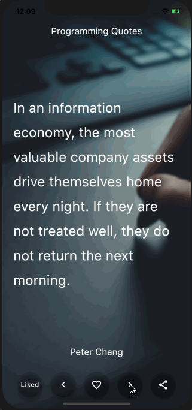

# Programming Quotes

## Brief description
This project is developed to participate in the [Flutter Create Contest](https://flutter.dev/create). In the application, you can read quotes of great different people. If you feel you need a piece of advice - this app can give a motivation to develop yourself!

### Available features:
- Show approx. 400 wise thoughts from engineers, scientists, etc;
- Like quotes;
- Show different images in a background;
- Share quotes with others;
- Left and right swipes are supported.

### More facts:
- On a startup application, a random sequence of quotes was built. You can go forward or back along this sequence. If you scroll quickly, you can come back and read more carefully or like a quote.
- All liked quotes saved in the separate list, and available after closing the application.
- There is a button between switching lists of quotes you liked and not yet.
- The background image changes once in 9 shifts of quotes. Value of blur each time occurs randomly: the sigma parameter is selected from 1 to 6 for both axes.
- 30 different images are available in total. Images are taken from the site https://unsplash.com by computers, technologies topics.
- Quotes are taken from different sources available online.
- Font size is scaled by the length of the quote to fit the screen size.

### Demo:

According to the contest rules, all source code size must be less than 5KB. I'm didn't use 'dartfmt' here, so there is a tradeoff between code quality and available functionality.

If you want to say thank you or any other reasons, you can contact me via email: a.holikau1@gmail.com

Enjoy!